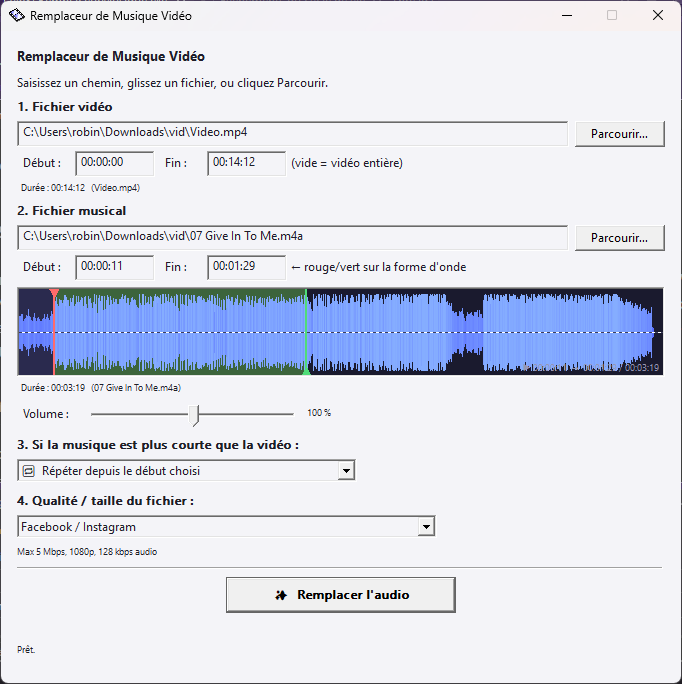

remplaceurMusique
=============

Les logiciels d'édition vidéo traditionnels sont souvent trop complexes pour un besoin simple : **remplacer le son d'une vidéo par une piste musicale**
Ce logiciel propose une interface simplifier pour ce cas d'usage

Il utilise [Microsoft Media Foundation](https://learn.microsoft.com/fr-fr/windows/win32/medfound/about-the-media-foundation-sdk) pour l'encodage. Et l'api Win32 pour l'interface graphique.
Ce logiciel fonctionne seulement sur Windows 10/11

Screenshot
-------------

build
------

Le projet est construit avec VisualStudio 2026. Soit avec l'interface, soit avec msbuild